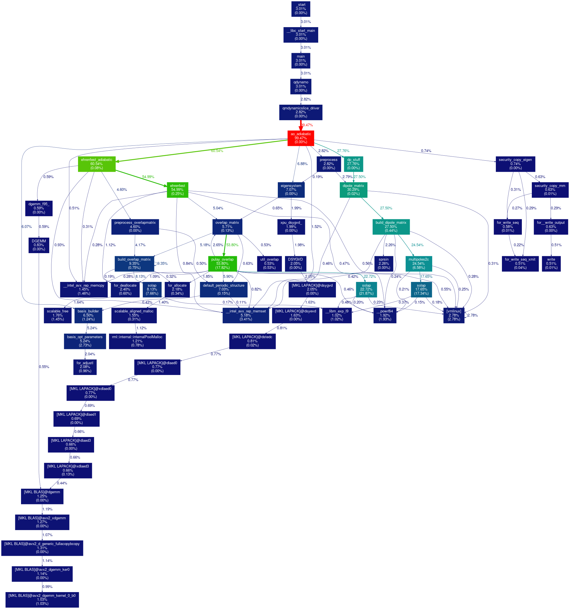

# Serial

Description of the profiling process for the serial version.


## Motivation

- Get base statistics to calculate improvements from.
- Know where to focus work.
  - Know which functions are the most time/processing power consuming ones.

### Compiling

Compiled with:
```bash
$ make serial 	# removes parallel flags and adds debug
```


## VTune

### Collecting (hotspots)

This step cant take a long time to complete. It took ~30 minutes to execute completely on a reasonably powerful machine. Go grab a coffee...

Ran with:
```bash
$ export OMP_NUM_THREADS=1 && \				# forces blas/lapack to use one thread only
  amplxe-cl -collect advanced-hotspots \ 		# specify which data to collect
  -data-limit=30000 \					# sets data size limit
  -verbose \
  -r ../profile/serialhotspots \				# where to save collected data
  -knob collection-detail=stack-and-callcount  -- \	# collects more info
  ./a 							# program to run
```

Brief explanation:

- In the beginning, the serial version was mysteriously creating threads. It was found that it was because of Intel's MKL libraries. See [site](https://software.intel.com/en-us/articles/intel-math-kernel-library-intel-mkl-using-intel-mkl-with-threaded-applications/) for more info. Setting the `OMP_NUM_THREADS` to 1 forces it to use 1 thread only.
- `-collect advanced-hotspots` allows more advanced configurations to be set to the profiling software. Basically a `-collect hotspots` on steroids.
- `-data-limit=30000` sets a higher limit to the size of collected data.
- `-knob collection-detail=stack-and-callcount` adds this option to the collection process. According to Intel's [reference](https://software.intel.com/en-us/vtune-amplifier-help-knob):
> Extend the stack-and-callcount collection with an analysis of loop trip count statistically estimated using the hardware events. This value is used for advanced-hotspots only.

### Collecting (hpc-performance)

Ran with:
```bash
$ export OMP_NUM_THREADS=1 && \			# forces blas/lapack to use one thread only
  amplxe-cl -collect hpc-performance \ 		# specify which data to collect
  -data-limit=30000 \					# sets data size limit
  -verbose \
  -r ../profile/serialhpc --\				# where to save collected data
  ./a 							# program to run
```

### Reporting


#### Hotspots

Report generated with:
```bash
$ amplxe-cl -report hotspots \
  -r ../profile/serial/ \
  -group-by function \
  -column 'CPU Time:Self,CPU Time:Effective Time:Self,Estimated Call Count:Self,Source File' \
  -limit 5
```

Output:

Function      | CPU Time | CPU Time:Effective Time | Estimated Call Count | Source File       |
:------------ | -------: | ----------------------: | -------------------: | :---------------- |
solap         |   6.282s |                  6.282s |           10,838,241 | overlap_D.f       |
pulay_overlap |   5.118s |                  5.118s |                    0 | overlap_D.f       |
solap         |   4.981s |                  4.981s |                    0 | multip_routines.f |
solap         |   2.200s |                  2.200s |                    0 | overlap_D.f       |
multipoles2c  |   1.891s |                  1.891s |            3,026,413 | multip_routines.f |


#### Hardware events

Report generated with:
```bash
$ amplxe-cl -report hw-events \
  -r ../profile/serial/ \
  -column 'Hardware Event Count:CPU_CLK_UNHALTED.THREAD:Self,Hardware Event Count:CALL_COUNT:Self,Source File'
  -limit 5
```

Output:

| Function      | CPU_CLK_UNHALTED.THREAD (K) | CALL_COUNT (K) |  Source File       |
| :------------ | --------------------------: | -------------: | :----------------- |
| solap         |                  20,864,171 |         10,838 |  overlap_D.f       |
| solap         |                  15,086,256 |              0 |  multip_routines.f |
| pulay_overlap |                  14,078,303 |              0 |  overlap_D.f       |
| multipoles2c  |                   7,889,625 |          3,026 |  multip_routines.f |
| solap         |                   7,121,524 |              0 |  overlap_D.f       |


#### Callstacks

Report generated with:
```bash
$ amplxe-cl -report callstacks \
  -r ../profile/serial/ \
  -group-by function \
  -column 'CPI Rate' \
  | grep 'solap\|pulay\|multipoles' # show only the desired ones
```

Output:

| Function      | CPI rate |
| :------------ | -------: |
| solap         |    2.400 |
| solap         |    1.224 |
| solap         |    1.066 |
| multipoles2c  |    0.953 |
| pulay_overlap |    0.888 |


#### HPC Performance

Report generated with:
```bash
$ amplxe-cl -report summary \
  -r ../profile/serialhpc/ \
  -report-knob show-issues=false
```

Output:
```
Effective Physical Core Utilization: 4.8% (0.969 out of 20)
    Effective Logical Core Utilization: 2.4% (0.970 out of 40)
```

## Perf

Command:
```bash
$ export OMP_NUM_THREADS=1 && perf stat -d ./a
```

Output:
```
 Performance counter stats for './a':

      26120.448170      task-clock (msec)         #    0.999 CPUs utilized
               234      context-switches          #    0.009 K/sec
                98      cpu-migrations            #    0.004 K/sec
            16,524      page-faults               #    0.633 K/sec
    85,404,966,300      cycles                    #    3.270 GHz                      (49.99%)
   <not supported>      stalled-cycles-frontend
   <not supported>      stalled-cycles-backend
   213,633,417,733      instructions              #    2.50  insns per cycle          (62.49%)
    26,005,371,788      branches                  #  995.594 M/sec                    (62.51%)
       125,603,446      branch-misses             #    0.48% of all branches          (62.52%)
    47,564,745,796      L1-dcache-loads           # 1820.977 M/sec                    (62.53%)
     2,072,011,037      L1-dcache-load-misses     #    4.36% of all L1-dcache hits    (62.52%)
       255,154,334      LLC-loads                 #    9.768 M/sec                    (50.02%)
           284,717      LLC-load-misses           #    0.11% of all LL-cache hits     (50.00%)

      26.142284619 seconds time elapsed
```

## Gprof2Dot

See this [blog](https://software.intel.com/en-us/blogs/2013/04/05/making-visualized-call-graph-from-intel-vtune-amplifier-xe-results) post for more info.

Generated `gprof` data with:
```bash
$ amplxe-cl -report gprof-cc \
  -r ../profile/serialhotspots/ \
  -format text \
  -report-output out_serial.txt
```

Generated `.png` with:
```bash
$ gprof2dot -f axe out.txt | dot -Tpng -o serial.png
```

Output:


